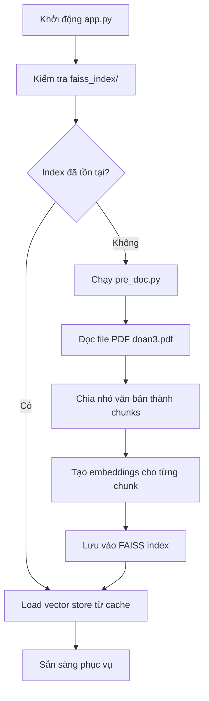

# Hệ thống Chatbot RAG - Quản lý File và Tra cứu Thông tin

## 🎯 Mô tả Dự án

Hệ thống chatbot sử dụng RAG (Retrieval-Augmented Generation) để tra cứu thông tin từ tài liệu PDF với giao diện web thân thiện.

## ✨ Tính năng

- 📄 Upload và xử lý file PDF tự động
- 🔍 Tìm kiếm thông tin thông minh bằng vector similarity
- 🤖 2 tùy chọn AI model:
  - **OpenAI GPT** (chất lượng cao, có phí)
  - **Hugging Face** (miễn phí, local processing)
- 🎨 Giao diện web đẹp với Streamlit
- 💾 Cache vector embeddings để tái sử dụng

## 🚀 Cài đặt Nhanh

### Windows

```bash
# Chạy file setup
setup.bat
```

### Linux/Mac

```bash
# Chạy file setup
chmod +x setup.sh
./setup.sh
```

### Cài đặt thủ công

```bash
# Tạo virtual environment
python -m venv venv

# Kích hoạt (Windows)
venv\Scripts\activate
# Hoặc (Linux/Mac)
source venv/bin/activate

# Cài đặt dependencies
pip install -r requirements.txt
```

## ⚙️ Cấu hình

### 1. File PDF

- Đặt file PDF cần tra cứu vào thư mục dự án
- Đặt tên file là `doan3.pdf` hoặc sửa tên trong `pre_doc.py`

### 2. API Keys (Tùy chọn)

Sửa file `config.env`:

```env
# Để sử dụng OpenAI (có phí)
OPENAI_API_KEY=sk-your-actual-openai-api-key-here

# Để sử dụng Hugging Face (miễn phí)
# Không cần cấu hình gì thêm
```

## 🎮 Sử dụng

### Chạy ứng dụng

```bash
streamlit run app.py
```

### Sử dụng

1. Mở trình duyệt tại `http://localhost:8501`
2. Chọn model AI trong sidebar
3. Nhập câu hỏi về nội dung tài liệu
4. Xem kết quả và nguồn tham khảo

## 💰 Chi phí

### OpenAI API

- **Có phí** theo số token sử dụng
- Ước tính: ~$0.002/1000 tokens
- 1 câu hỏi ≈ 200-500 tokens
- Chi phí thực tế: ~$0.001-0.005/câu hỏi

### Hugging Face

- **Hoàn toàn miễn phí**
- Chạy local trên máy tính
- Không cần internet sau khi tải model

## 📋 Luồng Hoạt động Hệ thống

### 1. Khởi tạo và Preprocessing



### 2. Quy trình xử lý câu hỏi

```text
User Input → Embedding → FAISS Search → Context Retrieval → LLM Processing → Response
```

#### Chi tiết từng bước

**Bước 1: Tiền xử lý tài liệu** (`pre_doc.py`)

- Đọc file PDF sử dụng PyPDF2
- Chia văn bản thành chunks (1000 ký tự, overlap 200)
- Tạo embeddings sử dụng HuggingFace/OpenAI
- Lưu vào FAISS vector database
- Cache index để sử dụng lại

**Bước 2: Giao diện người dùng** (`app.py`)

- Khởi tạo Streamlit interface
- Load vector store từ cache
- Hiển thị sidebar cho cấu hình model
- Xử lý input từ người dùng

**Bước 3: Xử lý truy vấn** (`llm_rag.py`)

- Nhận câu hỏi từ user
- Tạo embedding cho câu hỏi
- Tìm kiếm top-k documents liên quan (similarity search)
- Kết hợp context với prompt template
- Gửi đến LLM (OpenAI/HuggingFace)
- Trả về câu trả lời + nguồn tham khảo

### 3. Luồng dữ liệu chi tiết

```text
┌─────────────────┐    ┌──────────────────┐    ┌─────────────────┐
│   doan3.pdf     │───▶│    pre_doc.py    │───▶│  faiss_index/   │
│                 │    │                  │    │                 │
│ - Tài liệu gốc  │    │ - Text extraction│    │ - index.faiss   │
│ - Nội dung cần  │    │ - Text chunking  │    │ - index.pkl     │
│   tra cứu       │    │ - Embeddings     │    │ - Vector cache  │
└─────────────────┘    └──────────────────┘    └─────────────────┘
                                │
                                ▼
┌─────────────────┐    ┌──────────────────┐    ┌─────────────────┐
│    app.py       │◄───│   llm_rag.py     │◄───│  config.env     │
│                 │    │                  │    │                 │
│ - UI Interface  │    │ - RAG Logic      │    │ - API Keys      │
│ - User Input    │    │ - LLM Calls      │    │ - Configuration │
│ - Display       │    │ - Context Search │    │                 │
└─────────────────┘    └──────────────────┘    └─────────────────┘
```

### 4. Các thành phần chính

#### **pre_doc.py - Document Processor**

- **Input**: File PDF (`doan3.pdf`)
- **Process**:
  - Trích xuất text từ PDF
  - Chia thành chunks với RecursiveCharacterTextSplitter
  - Tạo embeddings cho mỗi chunk
- **Output**: FAISS vector store (cache)

#### **llm_rag.py - RAG Engine**

- **Input**: User query + Vector store
- **Process**:
  - Similarity search trong vector database
  - Lấy top-k relevant chunks
  - Tạo context-aware prompt
  - Gọi LLM API
- **Output**: Generated answer + source references

#### **app.py - Web Interface**

- **Input**: User interactions
- **Process**:
  - Streamlit UI rendering
  - Model selection handling
  - Query processing coordination
- **Output**: Web interface + responses

### 5. Memory và Performance

```text
Startup Time:
├── Cold start (no cache): 30-60s
│   ├── PDF processing: 10-20s
│   ├── Embedding creation: 15-30s
│   └── Index building: 5-10s
└── Warm start (with cache): 3-5s
    └── Load existing index: 3-5s

Query Time:
├── Similarity search: 0.1-0.5s
├── LLM processing: 2-10s
│   ├── OpenAI API: 2-5s
│   └── HuggingFace local: 5-10s
└── Total response: 2-11s
```

### 6. Sequence Diagram - Luồng xử lý complete

```text
User    App.py    llm_rag.py    pre_doc.py    FAISS    LLM_API
 │        │           │            │           │         │
 │ ──────▶│ Question   │            │           │         │
 │        │───────────▶│ Process    │           │         │
 │        │           │ ──────────▶│ Check     │         │
 │        │           │           │◄──────────│ Load    │
 │        │           │◄───────────│ Vector    │         │
 │        │           │───────────────────────▶│ Search  │
 │        │           │◄───────────────────────│ Results │
 │        │           │───────────────────────────────▶│ Generate
 │        │           │◄───────────────────────────────│ Answer
 │        │◄───────────│ Response   │           │         │
 │◄───────│ Display    │            │           │         │
```

## 🔧 Cấu trúc Dự án

```text
llm_chatbot_genAI/
├── app.py              # Giao diện Streamlit chính
├── llm_rag.py          # Engine RAG và xử lý LLM
├── pre_doc.py          # Tiền xử lý tài liệu PDF
├── test_system.py      # Test và validation
├── requirements.txt    # Python dependencies
├── config.env          # Cấu hình API keys
├── setup.bat           # Setup script cho Windows
├── setup.sh            # Setup script cho Linux/Mac
├── doan3.pdf           # Tài liệu PDF nguồn
├── .gitignore          # Git ignore patterns
├── faiss_index/        # Cache vector embeddings
│   ├── index.faiss     # FAISS vector database
│   └── index.pkl       # Metadata và configuration
└── __pycache__/        # Python compiled files
```

## 🛠️ Khắc phục Sự cố

### Lỗi import modules

```bash
pip install --upgrade langchain langchain-community
```

### Lỗi PDF không đọc được

- Kiểm tra file PDF có tồn tại
- Đảm bảo PDF không bị password protect
- Thử chuyển đổi PDF về định dạng khác

### Lỗi memory khi chạy Hugging Face

- Giảm chunk_size trong `pre_doc.py`
- Sử dụng model nhẹ hơn (gpt2 thay vì DialoGPT)

### OpenAI API error

- Kiểm tra API key trong `config.env`
- Đảm bảo có credit trong tài khoản OpenAI
- Chuyển sang sử dụng Hugging Face

## 📊 Tối ưu Performance

1. **Vector Store Cache**: Tự động save/load FAISS index
2. **Chunk Optimization**: Chunk size 1000, overlap 200
3. **Model Selection**: Chọn model phù hợp với tài nguyên
4. **Error Handling**: Xử lý lỗi toàn diện

## 🔮 Phát triển tiếp

- [ ] Hỗ trợ nhiều định dạng file (DOCX, TXT)
- [ ] Upload file qua web interface
- [ ] Chat history
- [ ] Multi-language support
- [ ] API endpoints
- [ ] Database integration

## 📝 License

MIT License - Sử dụng tự do cho mục đích học tập và nghiên cứu.

## 👥 Đóng góp

Mọi đóng góp và góp ý đều được hoan nghênh!
