# Hệ thống Chatbot RAG Multi-Document - Quản lý và Tra cứu Thông tin

## 🎯 Mô tả Dự án

Hệ thống chatbot sử dụng RAG (Retrieval-Augmented Generation) để tra cứu thông tin từ nhiều tài liệu PDF với giao diện web thân thiện và khả năng quản lý tài liệu linh hoạt.

## ✨ Tính năng Chính

### � Quản lý Multi-Document

- **Upload PDF qua giao diện web** - Kéo thả hoặc chọn file
- **Xử lý tự động** - Tạo vector store ngay sau khi upload
- **Quản lý linh hoạt** - Xem, xóa, rebuild từng tài liệu
- **Kết hợp thông minh** - Tìm kiếm trên nhiều tài liệu cùng lúc

### 🔍 Tìm kiếm Thông minh

- **Vector similarity search** - Tìm kiếm ngữ nghĩa chính xác
- **Multi-source retrieval** - Kết hợp thông tin từ nhiều nguồn
- **Source tracking** - Hiển thị nguồn tham khảo chi tiết
- **Relevance filtering** - Lọc kết quả có liên quan

### 🤖 AI Models

- **OpenAI GPT** - Chất lượng cao, trả lời chi tiết
- **Google Gemini** - Miễn phí, hiệu suất tốt
- **Auto-fallback** - Tự động chuyển đổi khi cần

### 🎨 Giao diện Thân thiện

- **Streamlit modern UI** - Giao diện đẹp, responsive
- **Real-time feedback** - Cập nhật trạng thái tức thì
- **Progress tracking** - Hiển thị tiến trình xử lý
- **Statistics dashboard** - Thống kê tài liệu và usage

## 🚀 Cài đặt Nhanh

### Windows

```bash
# Chạy file setup
setup.bat
```

### Linux/Mac

```bash
# Chạy file setup
chmod +x setup.sh
./setup.sh
```

### Cài đặt thủ công

```bash
# Tạo virtual environment
python -m venv venv

# Kích hoạt (Windows)
venv\Scripts\activate
# Hoặc (Linux/Mac)
source venv/bin/activate

# Cài đặt dependencies
pip install -r requirements.txt
```

## ⚙️ Cấu hình

### 1. File PDF

- Đặt file PDF cần tra cứu vào thư mục `documents/`
- Hoặc upload trực tiếp qua giao diện web
- Hỗ trợ nhiều file PDF cùng lúc

### 2. API Keys (Tùy chọn)

Sửa file `config.env`:

```env
# Để sử dụng OpenAI (có phí)
OPENAI_API_KEY=sk-your-actual-openai-api-key-here

# Để sử dụng Google Gemini (miễn phí)
GEMINI_API_KEY=your-actual-gemini-api-key-here
```

## 🎮 Sử dụng

### Chạy ứng dụng

```bash
streamlit run app.py
```

### Sử dụng

1. Mở trình duyệt tại `http://localhost:8501`
2. **Upload tài liệu**: Sử dụng tab "📚 Tài liệu" trong sidebar để upload PDF
3. **Chọn model AI** trong tab "🔧 Model"
4. **Nhập câu hỏi** về nội dung tài liệu
5. **Xem kết quả** và nguồn tham khảo chi tiết

### Quản lý Tài liệu

- **Upload**: Kéo thả file PDF vào giao diện
- **Xử lý**: Hệ thống tự động tạo vector store
- **Xem trạng thái**: Kiểm tra tài liệu nào đã được xử lý
- **Xóa**: Loại bỏ tài liệu không cần thiết
- **Rebuild**: Tái tạo toàn bộ vector store

## 💰 Chi phí

### OpenAI API

- **Có phí** theo số token sử dụng
- Ước tính: ~$0.002/1000 tokens
- 1 câu hỏi ≈ 200-500 tokens
- Chi phí thực tế: ~$0.001-0.005/câu hỏi

### Google Gemini API

- **Miễn phí** với quota hàng tháng
- Quota: 15 requests/phút, 1500 requests/ngày
- Không cần thanh toán cho sử dụng cơ bản

## 📋 Luồng Hoạt động Hệ thống

### 1. Khởi tạo và Preprocessing

```mermaid
graph TD
    A[Khởi động app.py] --> B[Kiểm tra faiss_index/]
    B --> C{Index đã tồn tại?}
    C -->|Có| D[Load vector store từ cache]
    C -->|Không| E[Chạy pre_doc.py]
    E --> F[Đọc file PDF doan3.pdf]
    F --> G[Chia nhỏ văn bản thành chunks]
    G --> H[Tạo embeddings cho từng chunk]
    H --> I[Lưu vào FAISS index]
    I --> D
    D --> J[Sẵn sàng phục vụ]
```



### 2. Quy trình xử lý câu hỏi

```text
User Input → Embedding → FAISS Search → Context Retrieval → LLM Processing → Response
```

#### Chi tiết từng bước

**Bước 1: Tiền xử lý tài liệu** (`pre_doc.py`)

- Đọc file PDF sử dụng PyPDF2
- Chia văn bản thành chunks (1000 ký tự, overlap 200)
- Tạo embeddings sử dụng HuggingFace/OpenAI
- Lưu vào FAISS vector database
- Cache index để sử dụng lại

**Bước 2: Giao diện người dùng** (`app.py`)

- Khởi tạo Streamlit interface
- Load vector store từ cache
- Hiển thị sidebar cho cấu hình model
- Xử lý input từ người dùng

**Bước 3: Xử lý truy vấn** (`llm_rag.py`)

- Nhận câu hỏi từ user
- Tạo embedding cho câu hỏi
- Tìm kiếm top-k documents liên quan (similarity search)
- Kết hợp context với prompt template
- Gửi đến LLM (OpenAI/HuggingFace)
- Trả về câu trả lời + nguồn tham khảo

### 3. Luồng dữ liệu chi tiết

```text
┌─────────────────┐    ┌──────────────────┐    ┌─────────────────┐
│   doan3.pdf     │───▶│    pre_doc.py    │───▶│  faiss_index/   │
│                 │    │                  │    │                 │
│ - Tài liệu gốc  │    │ - Text extraction│    │ - index.faiss   │
│ - Nội dung cần  │    │ - Text chunking  │    │ - index.pkl     │
│   tra cứu       │    │ - Embeddings     │    │ - Vector cache  │
└─────────────────┘    └──────────────────┘    └─────────────────┘
                                │
                                ▼
┌─────────────────┐    ┌──────────────────┐    ┌─────────────────┐
│    app.py       │◄───│   llm_rag.py     │◄───│  config.env     │
│                 │    │                  │    │                 │
│ - UI Interface  │    │ - RAG Logic      │    │ - API Keys      │
│ - User Input    │    │ - LLM Calls      │    │ - Configuration │
│ - Display       │    │ - Context Search │    │                 │
└─────────────────┘    └──────────────────┘    └─────────────────┘
```

### 4. Các thành phần chính

#### **pre_doc.py - Document Processor**

- **Input**: File PDF (`doan3.pdf`)
- **Process**:
  - Trích xuất text từ PDF
  - Chia thành chunks với RecursiveCharacterTextSplitter
  - Tạo embeddings cho mỗi chunk
- **Output**: FAISS vector store (cache)

#### **llm_rag.py - RAG Engine**

- **Input**: User query + Vector store
- **Process**:
  - Similarity search trong vector database
  - Lấy top-k relevant chunks
  - Tạo context-aware prompt
  - Gọi LLM API
- **Output**: Generated answer + source references

#### **app.py - Web Interface**

- **Input**: User interactions
- **Process**:
  - Streamlit UI rendering
  - Model selection handling
  - Query processing coordination
- **Output**: Web interface + responses

### 5. Memory và Performance

```text
Startup Time:
├── Cold start (no cache): 30-60s
│   ├── PDF processing: 10-20s
│   ├── Embedding creation: 15-30s
│   └── Index building: 5-10s
└── Warm start (with cache): 3-5s
    └── Load existing index: 3-5s

Query Time:
├── Similarity search: 0.1-0.5s
├── LLM processing: 2-10s
│   ├── OpenAI API: 2-5s
│   └── HuggingFace local: 5-10s
└── Total response: 2-11s
```

### 6. Sequence Diagram - Luồng xử lý complete

```text
User    App.py    llm_rag.py    pre_doc.py    FAISS    LLM_API
 │        │           │            │           │         │
 │ ──────▶│ Question   │            │           │         │
 │        │───────────▶│ Process    │           │         │
 │        │           │ ──────────▶│ Check     │         │
 │        │           │           │◄──────────│ Load    │
 │        │           │◄───────────│ Vector    │         │
 │        │           │───────────────────────▶│ Search  │
 │        │           │◄───────────────────────│ Results │
 │        │           │───────────────────────────────▶│ Generate
 │        │           │◄───────────────────────────────│ Answer
 │        │◄───────────│ Response   │           │         │
 │◄───────│ Display    │            │           │         │
```

## 🔧 Cấu trúc Dự án

```text
llm_chatbot_genAI/
├── app.py              # Giao diện Streamlit chính
├── llm_rag.py          # Engine RAG và xử lý LLM
├── pre_doc.py          # Tiền xử lý tài liệu PDF
├── requirements.txt    # Python dependencies
├── config.env          # Cấu hình API keys
├── setup.bat           # Setup script cho Windows
├── setup.sh            # Setup script cho Linux/Mac
├── documents/          # Thư mục chứa các file PDF
│   ├── doan3.pdf       # File PDF mẫu
│   └── kb_dbms.pdf     # File PDF khác
├── vector_stores/      # Cache vector embeddings
│   ├── doan3.pdf_12345/ # Vector store cho file 1
│   └── kb_dbms.pdf_67890/ # Vector store cho file 2
└── .gitignore          # Git ignore patterns
```

## 🛠️ Khắc phục Sự cố

### Lỗi import modules

```bash
pip install --upgrade langchain langchain-community
```

### Lỗi PDF không đọc được

- Kiểm tra file PDF có tồn tại
- Đảm bảo PDF không bị password protect
- Thử chuyển đổi PDF về định dạng khác

### Lỗi memory khi chạy Hugging Face

- Giảm chunk_size trong `pre_doc.py`
- Sử dụng model nhẹ hơn (gpt2 thay vì DialoGPT)

### OpenAI API error

- Kiểm tra API key trong `config.env`
- Đảm bảo có credit trong tài khoản OpenAI
- Chuyển sang sử dụng Hugging Face

## 📊 Tối ưu Performance

1. **Vector Store Cache**: Tự động save/load FAISS index
2. **Chunk Optimization**: Chunk size 1000, overlap 200
3. **Model Selection**: Chọn model phù hợp với tài nguyên
4. **Error Handling**: Xử lý lỗi toàn diện

## 🔮 Phát triển tiếp

- [x] Hỗ trợ nhiều file PDF
- [x] Upload file qua web interface
- [x] Quản lý tài liệu linh hoạt
- [x] Multi-document search
- [ ] Hỗ trợ DOCX, TXT, CSV
- [ ] Chat history và session
- [ ] Multi-language support
- [ ] API endpoints RESTful
- [ ] Database integration (PostgreSQL)
- [ ] User authentication
- [ ] Advanced analytics dashboard

## 📝 License

MIT License - Sử dụng tự do cho mục đích học tập và nghiên cứu.

## 👥 Đóng góp

Mọi đóng góp và góp ý đều được hoan nghênh!
